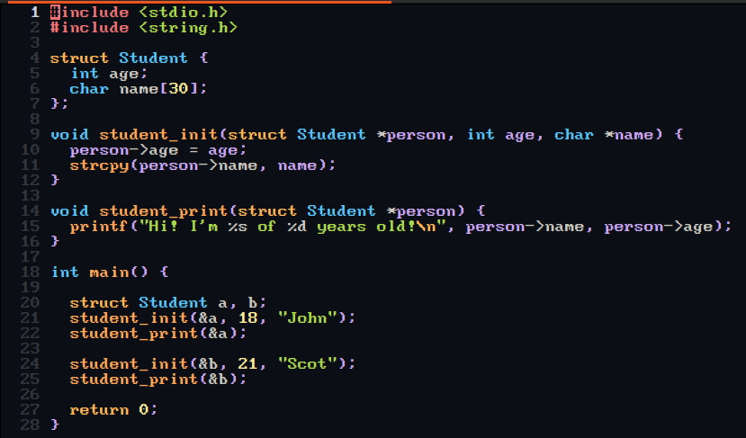
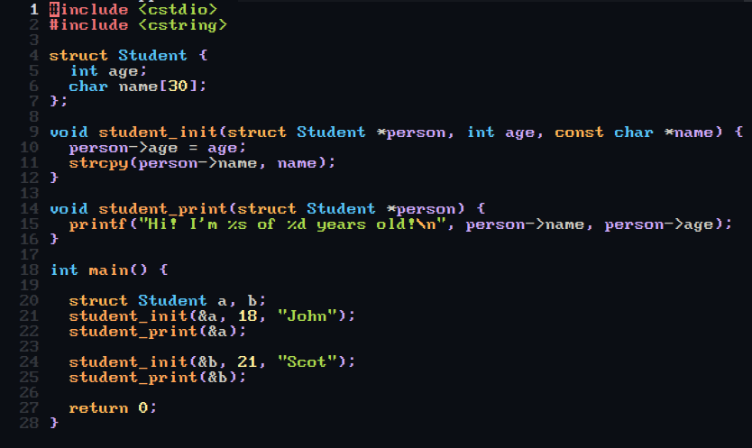
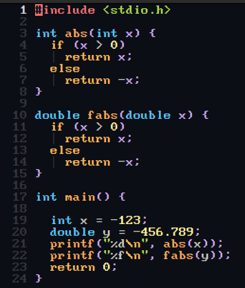
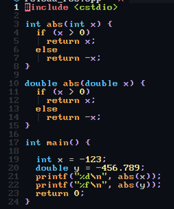

# How code changes from C to CPP.

__info : all code in dir [code](./code).__

For start we look, how look code in begin.  

  

What we see? They same, almost.   
Only differences, it's name includes.  

```c
#include <stdio.h>
#include <string.h>

#include <cstdio>
#include <cstring>
```

## Function to method

Now we change function to method. You may look that in [foo_to_method.cpp](code/foo_to_method.cpp)

In struct we add declaration of method and then we change name function.  
Fist: we set the name of space, where metod declaration;  
Second: set operator "::". That say us, what that method located in that namespace.  

And what we have:

``` c++
struct Student {
  int age;
  char name[30];
  void init(struct Student *person, int age, const char *name);
  void print(struct Student *person);
};
```

``` c++
// this is just the beginning of the description of the method, all code look in dir code
void Student::init 
void Student::print 
```

After that, we can call the method using operator ".", like that:  

``` c++
int main() {
  struct Student a, b;
  a.init(&a, 18, "John");
  b.print(&a);
  b.init(&b, 21, "Scot");
  b.print(&b);
  return 0;
}
```

## Struct to class

Now our struct almost look like class, but a little changes are needed.  

First: need understand, if struct default public, class default private. In struct, we can call the elements, when want it. In class, needs to be explicitly declared, for get access.  
Second: sintaksis change, struct on class and we explicitly declared private and public methods and variables. And now we can remove name our clase from parametrs in metods.  
To call class parameter, need using special word "this".  

``` c++
// it was
person->age = age;
// it became
this->age = age;
```

``` c++
// it was
struct Student {
  int age;
  char name[30];
  void init(struct Student *person, int age, const char *name);
  void print(struct Student *person);
};
// it became
class Student {
private: // not necessary
  int age;
  char name[30];
public:
  void init(int age, const char *name);
  void print() const; // for a const object, only const functions can be called
};
```

## Creating constructor (not lego)  

If we need set critical information to ours program, we can use constructor.  
For example, we have method init to bring main information. On his base, we create constructor.  

``` c++
class Student {
private: // not necessary
  int age;
  char name[30];
public:
  Student(int age, const char *name); // constructor
  void print() const;
};
```

The name of constructor, need to be how on name class.  

``` c++
// it was
void Student::init(int age, const char *name) {
  this->age = age;
  strcpy(this->name, name);
}
// it became
Student::Student(int age, const char *name) {
  this->age = age;
  strcpy(this->name, name);
}
```

The constructor is always called, when you create objeck of class.  
If you need set some parameter, it's doing like that.  

``` c++
Student a(18, "John");
```

On that code, we create object of class and this parameters sent to our constructor.  

## Inheritance.

In code you can see, we have class Student and class Teacher. Their description is similar. This means that we can create a parent class from which they will inherit.    
We create class Person and set "protected:". It is necessary to get access to "age" and "name".  

``` c++
class Person {
protected:
  int age;
  char name[30];
};

class Student : public Person { // here need write public to get access to age and name
public:
  Student(int age, const char *name); // constructor
  void print() const;
};

class Teacher : public Person { // // here need write public to get access to age and name
public:
  Teacher(int age, const char *name); // constructor
  void print() const;
};
```

Ok, now Student and Teacher inherit from Person. We see that the constructors similar. In code you can see, description the constructor Student and the constructor Teacher. The code is repeated it's bad. We can stay one constuctor and move him to class Person and then Studen and Techer inherit him.   

``` c++
class Person {
protected:
  int age;
  char name[30];
public:
  Person(int age, const char *name); // constructor
};

Person::Person(int age, const char *name) {
  this->age = age;
  strcpy(this->name, name);
}
```

``` c++
class Student : public Person { // here Student inherit from Person
public:
  Student(int age, const char *name) : Person(age, name) {} // in documentation that called "constructor initialization list". From code we remove constructor Student and now here declaration constructor Student inherit description constructor Person.
  void print() const;
};

```

## Little bit of abstraction. (is's look like magic)  

Now we can ask the compiler for help. We can refactoring our main.
He's a smart guy and help us.

``` c++
int main() {
    // create the object of class
    Student a(18, "John");
    Teacher b(33, "Scot");
    Student c(18, "Mary");
    // in pointer array we set addresses our objects
    Person *people[3] = {&a, &b, &c};
    // and then print in cycle
    for (int i = 0; i < 3; i++) {
    people[i]->print();
  }
}
```

Looks like nothing out of the ordinary, but how he know what printing.  
In code you can see, print from Student and Teacher different, but here we see only one call her.  
That called "Virtual Function" or "Virtual Method". In code, it looks like this:  

``` c++
class Person {
protected:
  int age;
  char name[30];
public:
  Person(int age, const char *name);
  virtual void print() const = 0;  // here
};
```
The compiler yourself decides which method to use.  

## Function overloading and template function

  

In C don't have Function overloading, if you try compiler stop you.  
But in CPP, that have.  
You can see in code, names functions is identical, but compiler understand what the function you need.  
It is look awesome, but we have two function too similar and we can use templates.  

``` c++
template <typename T> T abs(T x) { // template <typename T> T is special word
  if (x > 0)
    return x;
  else
    return -x;
}
```

Main remains the same, but we remove two function abs and printing one with template.  
And here compiler make magic, him understood what need to do.  

In this stage my knowledge is over. In future I add this repo.  